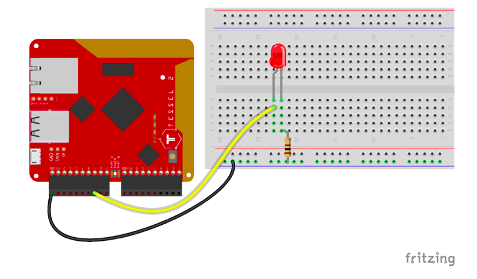

This example pulses an LED attached to the Tessel 2's pin `A5` (demonstrating PWM).

## Circuit Diagram



## Preparation

See the [main repo README](../README.md) for preparing the Tessel for use with Johnny-Five.

## Usage

```
$ t2 init
$ npm install johnny-five tessel-io
$ node index.js
```
