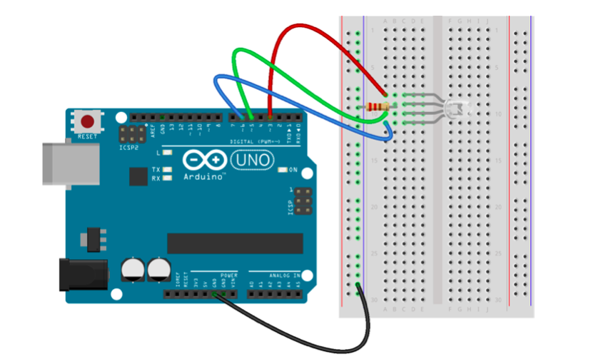

This example displays the major colors of the rainbow on a common-cathode RGB LED attached to the Uno's pins 3, 5 and 6. It shows each color for one second and cycles through them on a loop.

## Circuit Diagram



## Preparation

See the [main repo README](../README.md) for preparing the Uno for use with Johnny-Five.

## Usage

```
$ npm install johnny-five
$ node index.js
```
