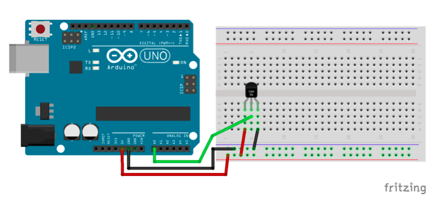

This example logs temperature from a TMP36 analog temperature sensor to the console.

## Circuit Diagram



## Preparation

See the [main repo README](../README.md) for preparing the Uno for use with Johnny-Five.

## Usage

```
$ npm install johnny-five
$ node index.js
```
