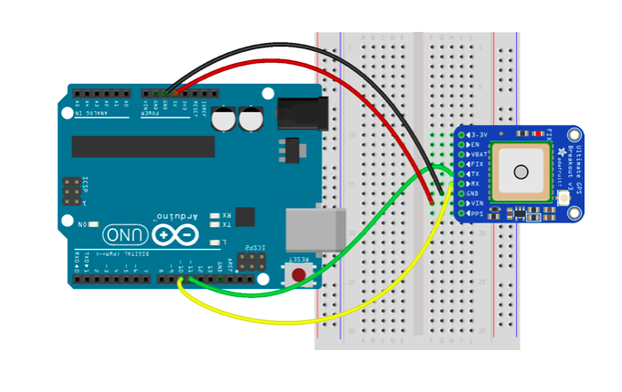

This example sets up a `GPS` object for the Adafruit Ultimate GPS breakout board.

## Circuit Diagram



## Preparation

See the [main repo README](../README.md) for preparing the Uno for use with Johnny-Five.

## Usage

```
$ npm install johnny-five
$ node index.js
```

Once REPL has started up, and the GPS has a fix, you can query it, as you'll have access to it within the REPL:

```
>> gps.latitude
42.73
>>
```
