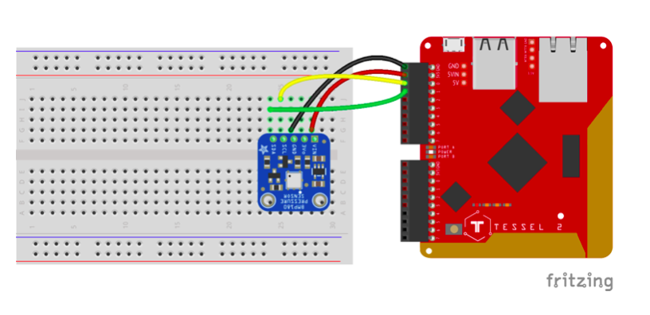
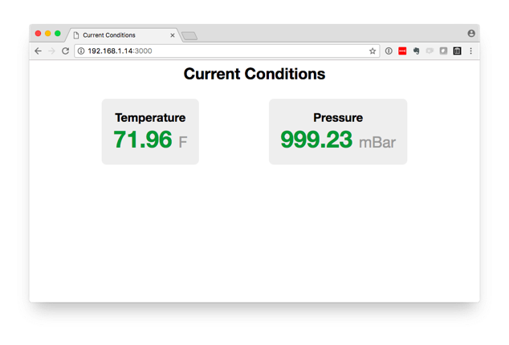

This example combines a Tessel 2, a BMP 180 multi sensor and the node ecosystem to create a real-time web-based temperature and pressure display.

## Circuit Diagram



## Preparation

See the [main repo README](../README.md) for preparing the Tessel for use with Johnny-Five.

## Code

You can find all of the code for [this example in the _JavaScript on Things_ book code repository here](https://github.com/lyzadanger/javascript-on-things/tree/master/chapter-08/04-t2-weather).

## Usage

. Create a project directory and populate it with all of the code (and subdirectories) [from the code repository](https://github.com/lyzadanger/javascript-on-things/tree/master/chapter-08/04-t2-weather)

```
$ t2 init
$ npm install johnny-five tessel-io express socket.io
$ t2 run index.js
```

## More Info

This project uses Web Socket to emit data to a connected web browser—showing temperature and pressure data in real time. Once the Tessel's web server is up and running, it will log out the URL to open in your web browser (your computer needs to be connected to the same network as the Tessel for this to work).

The simple weather station looks something like this:


