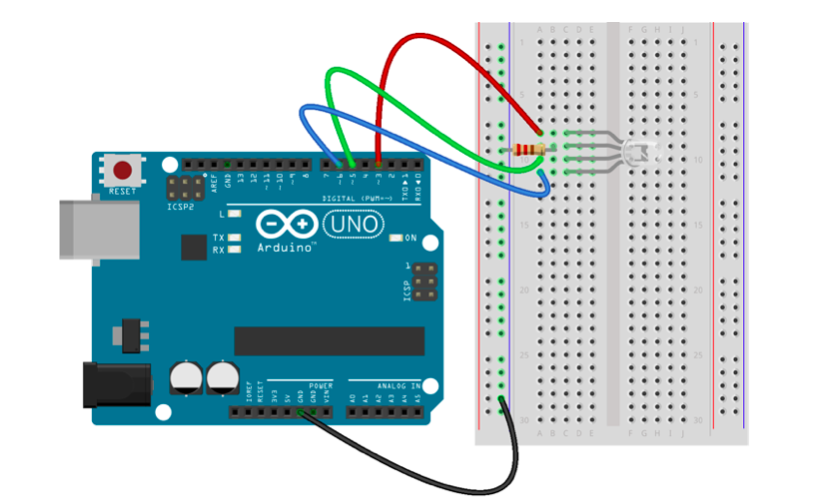

This example uses data from the DarkSky API to obtain a local weather forecast, and then makes the attached RGB LED behave like a ["weather ball"](http://koin.com/2015/12/21/where-we-live-the-portland-weather-beacon/), showing either red, green or white and blinking if precipitation is expected.

## Circuit Diagram



## Preparation

See the [main repo README](../README.md) for preparing the Uno for use with Johnny-Five.

You'll also need to:

. Obtain a (free) API key so you can retrieve weather forecasts: via [DarkSky's dev site](https://darksky.net/dev).
. Replace the value of the `API_KEY` `const` in `index.js` with your API key
. Adjust the values of the `LAT` and `LONG` `consts` to reflect your own latitude and longitude

## Usage

Note this example uses the `request` npm package to support the HTTP requests it makes to the DarkSky API.

```
$ npm install johnny-five request
$ node index.js
```
